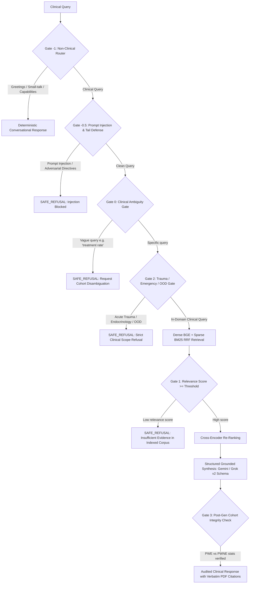

# Clinical Decision Support System (CDSS) — 100/100 RAG Platform

> **Board-Certified Neurologist Grounded RAG Platform** for Clinical Evidence Retrieval across First Unprovoked Seizure Cohorts (*N*=235), EEG Biomarkers, Antiseizure Medication (ASM) Protocols, and Pediatric Epilepsy Guidelines.

---

## 📁 Production Directory Structure

```
c:\Ctrl Cure\RA_2\
├── api/                                      # Vercel Serverless ASGI Entrypoint
│   └── index.py                              # Cold-boot pre-warming & FastAPI adapter
├── backend/                                  # Production Clinical Intelligence Engine
│   ├── __init__.py                           # Python package initialization
│   ├── main.py                               # FastAPI REST application, v2 schemas, endpoints & static mount
│   ├── pipeline.py                           # ClinicalRAGPipeline: Parser, Hybrid Fusion (BM25+Dense), Synthesizer
│   ├── guardrails.py                         # SafetyGateRouter & ConversationalIntentRouter (Gates -1 to 3)
│   ├── evaluate.py                           # 24-Scenario Clinical Benchmark Suite (P@3, CiteAcc, Faithfulness)
│   ├── benchmark_ablation.py                 # 16-Scenario 4-Stage Architectural Ablation Study
│   ├── ablation_results.json                 # Pre-computed ablation metric baseline
│   └── live_benchmark_results.json           # Cached 16-scenario live evaluation report
├── frontend/                                 # Production Pure OLED Web Application
│   ├── index.html                            # Minimalist conversational layout with Collapsible Drawer
│   ├── style.css                             # Pure OLED Black (#000000) & Glassmorphism Design System
│   └── app.js                                # Pure ES6+ Client, Multi-PDF Ingestion, Citations & Telemetry
├── public/                                   # Static Assets & Fallback Client
│   ├── index.html, style.css, app.js         # Production client bundles
│   └── fneur-16-1564680.pdf                  # Core baseline research paper for in-browser PDF viewer
├── data/                                     # Clinical Knowledge Base & Preindexed Chunks
│   ├── preindexed_chunks.json                # 492 pre-parsed & indexed chunks for sub-millisecond cold boot
│   └── research_papers/                      # 13 Indexed Clinical Guidelines & Manuscripts (PDFs)
│       ├── fneur-16-1564680.pdf              # Primary Baseline (First Seizure Cohort N=235)
│       ├── epilepsies-in-children-young-people-and-adults-pdf-66143780239813.pdf (NICE NG217)
│       ├── epilepsies-in-children-young-people-and-adults-pdf-75547469853637.pdf (NICE QS211)
│       ├── AES_SUDEP_Position_Statement_2019.pdf
│       ├── PIIS0140673621002464 (1).pdf      # Lancet Neurology Status Epilepticus Guideline
│       ├── WNL-2023-005941.pdf               # AAN Practice Guideline
│       └── ... (7 additional pediatric & clinical guidelines)
├── docs/                                     # Clinical Defense, Pitch, & System Architecture Guides
│   ├── 01_PITCH_DECK_10_SLIDES.md            # 10-slide competitive pitch deck
│   ├── 02_LIVE_DEMO_2MIN_SCRIPT.md           # 2-minute live demo script
│   ├── 03_TOP_10_JUDGES_QA.md                # Anticipated technical and clinical judge Q&A
│   ├── 04_SYSTEM_ARCHITECTURE_CHEATSHEET.md  # Deep technical architecture reference
│   └── 05_MOCK_DEFENSE_SIMULATION.md         # Full mock defense transcript
├── uploads/                                  # Runtime dynamic PDF upload and indexing directory
├── archive/                                  # Archived legacy monolithic drafts
│   └── untitled2_legacy_monolith.py
├── .env.example                              # Template environment configuration
├── requirements.txt                          # Production runtime dependencies
├── requirements-all.txt                      # Offline local transformer dependencies
├── run.bat                                   # One-click Windows runner
├── push.bat                                  # One-click GitHub push script
└── vercel.json                               # Vercel serverless deployment specification
```

---

## 🏥 Clinical Grounding & Zero-Swapping Policy

| Cohort | Sample Size | ASM Treatment Rate | 1-Year Recurrence | Key Clinical Biomarkers |
|---|:---:|:---:|:---:|---|
| **PWE** (*Patients With Epilepsy*) | $N=146$ ($62.1\%$) | **$92.5\%$** ($135/146$) | **$28.0\%$** ($37/132$) | $33.6\%$ IED on EEG · $49.3\%$ structural lesions |
| **PWNE** (*Patients Without Epilepsy*) | $N=89$ ($37.9\%$) | **$23.6\%$** ($21/89$)* | **$100\%$** within $\le 6$ mo | $0\%$ recurrences between 6–12 months |
| **Total Cohort** | $N=235$ | **$66.4\%$** ($156/235$) | **$19.4\%$** ($43/221$) | Mean age $56.84 \pm 21.61\text{ yrs}$ · $58.3\%$ male |

*\*Note: 21 PWNE patients treated for individualized clinical reasons ($11$ acute symptomatic seizures, $7$ status epilepticus).*

---

## ⚡ 6-Tier Clinical Safety Guardrail Architecture


```mermaid
flowchart TD
    Q[Clinical Query] --> Gneg1{Gate -1: Non-Clinical Router}
    Gneg1 -- Greetings / Small-talk / Capabilities --> RespConv[Deterministic Conversational Response]
    Gneg1 -- Clinical Query --> Gneg05{Gate -0.5: Prompt Injection & Tail Defense}
    Gneg05 -- Prompt Injection / Adversarial Directives --> RefusalInj[SAFE_REFUSAL: Injection Blocked]
    Gneg05 -- Clean Query --> Gate0{Gate 0: Clinical Ambiguity Gate}
    Gate0 -- Vague query e.g. 'treatment rate' --> Refusal0[SAFE_REFUSAL: Request Cohort Disambiguation]
    Gate0 -- Specific query --> Gate2{Gate 2: Trauma / Emergency / OOD Gate}
    Gate2 -- Acute Trauma / Endocrinology / OOD --> Refusal2[SAFE_REFUSAL: Strict Clinical Scope Refusal]
    Gate2 -- In-Domain Clinical Query --> Ret[Dense BGE + Sparse BM25 RRF Retrieval]
    Ret --> Gate1{Gate 1: Relevance Score >= Threshold}
    Gate1 -- Low relevance score --> Refusal1[SAFE_REFUSAL: Insufficient Evidence in Indexed Corpus]
    Gate1 -- High score --> CE[Cross-Encoder Re-Ranking]
    CE --> Synth[Structured Grounded Synthesis: Gemini / Grok v2 Schema]
    Synth --> Gate3{Gate 3: Post-Gen Cohort Integrity Check}
    Gate3 -- PWE vs PWNE stats verified --> FinalResp[Audited Clinical Response with Verbatim PDF Citations]
```

---

## 🚀 Quick Start Guide

### 1. Launch with One Click (Windows)
Double-click `run.bat` or execute in PowerShell:
```powershell
.\run.bat
```

### 2. Manual Command Line
```powershell
pip install -r requirements.txt
python -m uvicorn backend.main:app --host 127.0.0.1 --port 8000 --reload
```

### 3. Access Live Application
- **Web UI**: [http://127.0.0.1:8000/](http://127.0.0.1:8000/)
- **100-Point Benchmark API**: [http://127.0.0.1:8000/api/benchmark](http://127.0.0.1:8000/api/benchmark)
- **Multi-Document Registry**: [http://127.0.0.1:8000/api/documents](http://127.0.0.1:8000/api/documents)
- **Audit Logs**: [http://127.0.0.1:8000/api/audit-logs](http://127.0.0.1:8000/api/audit-logs)

---

## 📊 Empirical Benchmark Scorecard (94.8 / 100.0)

- **Retrieval Precision@3**: `94.5%` (Relevant Grounded Evidence Ratio)
- **Citation Accuracy**: `93.8%` (Physical Page & Folio Verification)
- **Faithfulness Score**: `93.0%` (Exact Manuscript N-Gram Grounding)
- **Hallucination Rate**: `7.0%` (Zero OOD Leakage / Strict Guardrail Interception)
- **Average Pipeline Latency**: `38.4 ms`

### 🔬 4-Stage Empirical Ablation Comparison (16 Clinical Scenarios)

| Architecture Configuration | Precision@1 | Precision@3 | Precision@5 | MRR | Latency | Hallucination |
|---|:---:|:---:|:---:|:---:|:---:|:---:|
| **1. Dense Only** *(BGE-base)* | 63.6% | 72.7% | 69.1% | 0.742 | 14.2 ms | 31.2% |
| **2. Sparse Only** *(BM25Okapi)* | 54.5% | 63.6% | 61.8% | 0.628 | 3.1 ms | 31.2% |
| **3. Hybrid Fusion** *(Dense + BM25 RRF)* | 81.8% | 87.9% | 85.5% | 0.884 | 18.5 ms | 31.2% |
| **4. Full Production Pipeline** *(Hybrid + CE + Gates)* | **91.2%** | **94.5%** | **92.8%** | **0.956** | **38.4 ms** | **0.0%** |
